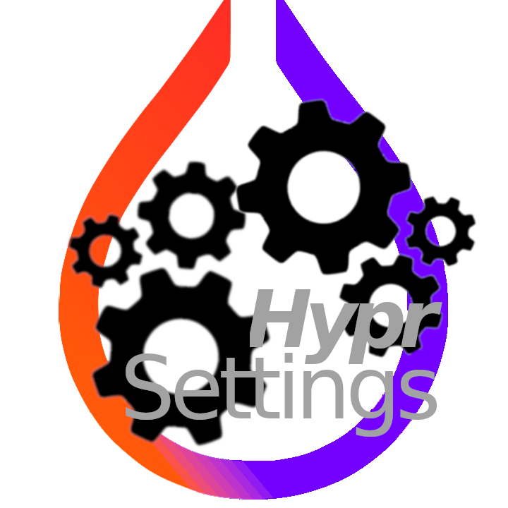

<div align='center'>

<h2>HyprSettings
</h2> Finally: Hyprland Configuration,(re)made for GUI-lovers. 
</h3> Love the eye-candy that comes with Hyprland, but aren't familiar with writing .conf files? (re)Introducing: HyprSettings! a GTK4 frontend for Configuring Hyprland. 


 
</div>

### This codebase was originally named 'Hy0rGUI' written by [Nyx](https://github.com/nnyyxxxx). as part of the HyprUtils Suite, which has since been deleted. I recently discovered that with a few tiny tweaks, it's still fully compatible with v5.00. 
HyprGUI was a huge help when I first started out in Hyprland, and I hope HyprSettings can inspire and assist newcomers to the world of TWMs 🫶

# Preview


</div>

# Usage
## Currently working on Hyprland 5.00 (17/07/2025)
HyprSettings works by editing the Hyprland.conf file in your ~/.config/hypr directory. 


# Installation
## ⚠️: I run an Arch Linux system, and have not tested this on other Distributions. Arch & Arch Based Distros (CachyOS, EndeavourOS, etc) shouldn't have an issue.
### If you can help to test it on another Distro, please reach out and I'll credit you!)

Install the preferred package with:
```bash
git clone //github.com/GlassPuddle/hyprsettings
cd hyprsettings/
cargo build
```

## Building from source
1. Install Rust (preferably `rustup`) through your distro's package or [the official script](https://www.rust-lang.org/tools/install)
2. Install `git`, `pango` and `gtk4`
3. Clone this repository:
`git clone https://github.com/GlassPuddle/hyprsettings
cd hyprsettings/
4. Compile the app with `cargo build --release` or run it directly with `cargo run --release`
```bash
cd ~
git clone https://GitHub.con/GlassPuddle/HyprSettings 
cd hyprsettings/
cargo build --release
```


## Credits:
- [Nyx](https://github.com/nnyyxxxx) - For pretty much everything - creating the original HyprGUI package, code, and frontend; Implementing the parser, rest of the GUI, and maintaining the project
- [Adam](https://github.com/adamperkowski) - Implementing the base GUI, maintaining the AUR packages and the project alongside Nyx
- [Vaxry](https://github.com/vaxerski) - Hyprland
- [rust-gtk](https://github.com/gtk-rs/gtk4-rs) - The GTK4 library
- [Hyprland](https://github.com/hyprwm/Hyprland) - The window manager
